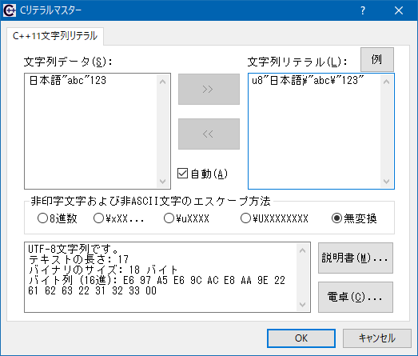

# Cリテラルマスター by 片山博文MZ

(Japanese, UTF-8)

## これは何？

C/C++ソースコードに記載されている文字列データが実際にどのようなバイナリデータになるのか、確かめたくなることはありませんか。

このプログラムは、対話的に文字列データと文字列リテラルを相互に変換できます。

## 使い方

実行ファイル「`cliteral.exe`」をダブルクリックして、変換したい文字列データや文字列リテラルを入力してください。すぐに結果が出ます。

「例」ボタンから、サンプルデータを選ぶことができます。

## 対応環境

- 英語または日本語の Windows XP、Windows Server 2003、Windows Vista、Windows 7、Windows 10、Windows 11 のいずれか。

## 使用許諾と免責事項

Cリテラルマスターは、MITライセンスで配布されるフリーソフトです。動作は無保証です。
